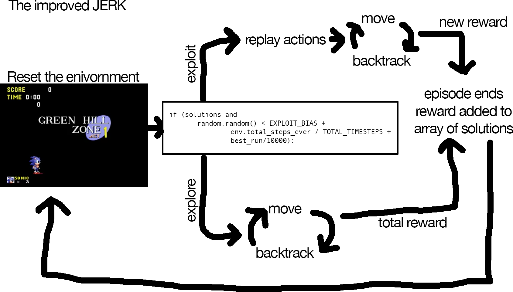
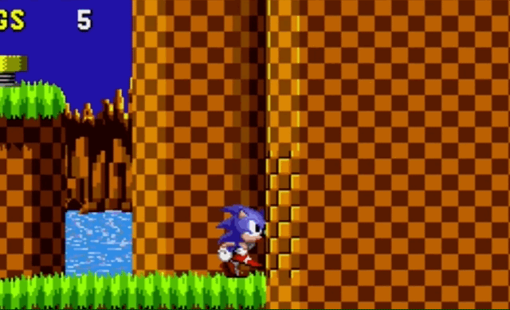
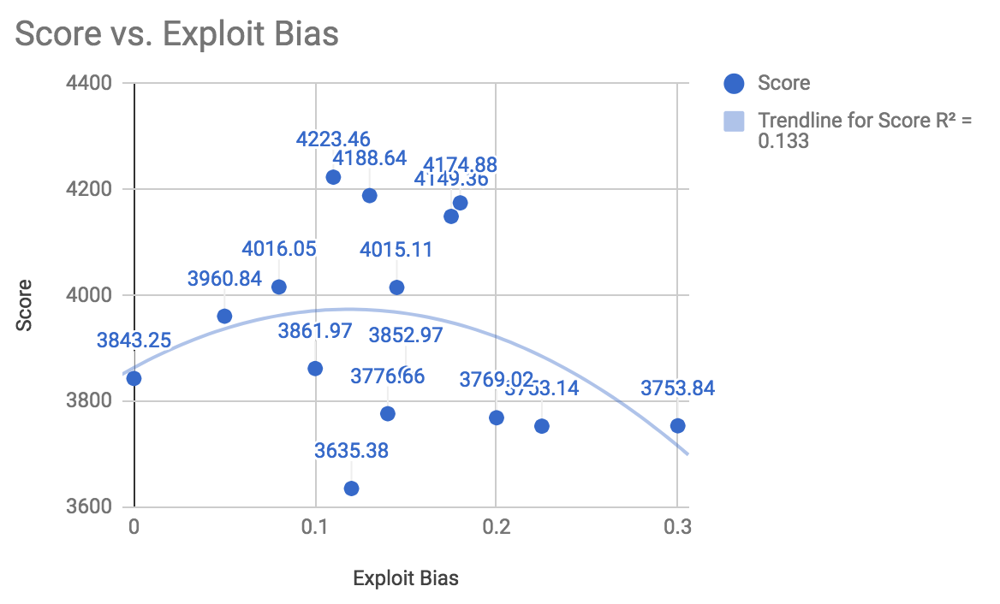

# The Improved Jerk Agent

The Jerk agent was a provided baseline for the [OpenAI Retro Contest](https://contest.openai.com/), you can find the original code in [openai/retro-baselines](https://github.com/openai/retro-baselines/blob/master/agents/jerk_agent.py). Throughout the contest I was able to make some useful improvements to the baseline agent, ultimately falling short of winning the contest, but ended up in the top 30 of the 200+ contestants. That is a pretty good result for ~150 lines of code! This is an explanation of how the improved-jerk agent works including my improvements. If you are interested in a description of how the providede baseline agent works, you can read [A Deep Dive into the JERK Agent](https://medium.com/@tristansokol/a-deep-dive-into-the-jerk-agent-3c553dbab442) or if you are only concerned with the improvements, I'd suggest [My Final Submisson: The Improved JERK](https://medium.com/@tristansokol/my-final-submission-the-improved-jerk-724bb54555ee).

## Background

The improved JERK agent is an AI agent for reinforcement learning that uses a combination of random exploration and episode exploitation to solve and optimise solutions to episodes for Sonic the Hedgehog. Initially the agent explores the environment somewhat randomly until the episode ends. With a previous solution stored, the agent continues to explore as well as repeat the best existing solution (exploit) until the training is over.

Here are definitions of some of the terms that I'll be using in case you are not familiar: 

* **Episode** a set of timesteps, actions, and rewards that defines a discreet engagement of the agent with the environment. For this code, an episode is a level of Sonic the Hedgehog gameplay, it starts when the level begins, and ends whenever Sonic dies, reaches the end, or runs out of time.

* **Action** This is an input the agent applies to the evironment. With our Sega Genesis version of Sonic, these correspond to a button press of the 12 buttoned Genesis controller. In our code they are represented by an array of 12 booleans `[False False False False False False False False False False False False]` corresponding to `[B, A, MODE, START, UP, DOWN, LEFT, RIGHT, C, Y, X, Z]`

* **Environment** This is the world of Sonic The Hedghog in the OpenAI Gym Retro environment. In this code the  environment is also wrapped into a larger class of a TrackedEnv, whichs take the initial environment and adds additional properties that will be used for learning  and three functions to interact with this new TrackedEnv that I will get into later. There are also a couple of variables set that will be used later on when the action gets going: new_ep which defines whether or not we should start a new episode, and solutions which will store a list of successful action sequences and their total reward.

```python
self.action_history = []
self.reward_history = []
self.total_reward = 0
self.total_steps_ever = 0
```


* **sticky frameskip** From [contest.openai.com/details](https://contest.openai.com/details): 
> The environment is stochastic in that it has sticky frameskip. While normal frameskip always repeats an action n times, sticky frameskip occasionally repeats an action n+1 times. When this happens, the following action is repeated one fewer times, since it is delayed by an extra frame. For the contest, sticky frameskip repeats an action an extra time with probability 0.25.

## The Agent



Lets take a look at each of those parts

### Moving
```python
move(env, num_steps, left, jump_prob, jump_repeat)
```

When the agent begins, it starts by taking a fresh episode and exploring it with the `move()` function. This function first sets up some variables to store the in-process responses from the environment before it starts interacting with the environment passed in with `env`:

```python
total_rew = 0.0 # the reward from all actions in this call of move
done = False # whether or not the episode has finished
steps_taken = 0 # a counter for the number of actions taken
jumping_steps_left = 0
```
Then it enters a loop that iterates through for the total number of num_steps that move() was called with.

The first thing that happens inside that loop is the creation of an an empty boolean array that will hold the value of the action to take. To play Sonic, you generally win by moving to the right to find the end of the level. We take advantage of this by designing the move function to always move the right, (or left in the case of back tracking that we will get to later). In the code this is achieved by assigning the 6th and 7th entries of our action array based on whether `move()` was called with the parameter `Left` being true. That means for this agent, every move is either going left or right, no standing still or just vertical jumping.

After that there is some logic to control jumping. There are two variables that control jumping behavior, the `jump_prob` and `jump_repeat`. `jump_prob` is the probability that for a given step, action[0] (the B button) will be set to true which will execute a jump in the game. For the default agent, the move() function is called in groups of 100 steps, so roughly 10 of them will include jumping, if it were not for `jump_repeat`. `jump_repeat` limits the number of times that you can have a jump inside the move() function, with a default of four, so if you are doing 100 steps, you will only have four jumps within those steps.

With our actions in place (move right or left, possibly jump as well) we can apply our button presses to the environment.

`_, rew, done, _ = env.step(action)`
The env.step function (as documented [here](https://github.com/openai/retro/blob/master/retro/retro_env.py#L145)) takes the array of actions that would be the moves for our controller and returns four variables, two of which we will use:

`rew` this is the incremental reward achieved from executing this command. The reward in our environment is determined how far from left to right the agent has controlled Sonic to go. 
`done` is a boolean value just describing if the game is over, either through sonic dying, timing out or getting to the end. 

The complete move functions looks like this:

```python
def move(env, num_steps, left=False, jump_prob=1.0 / 10.0, jump_repeat=4):
    total_rew = 0.0
    done = False
    steps_taken = 0
    jumping_steps_left = 0
    while not done and steps_taken < num_steps:
        #["B", "A", "MODE", "START", "UP", "DOWN", "LEFT", "RIGHT", "C", "Y", "X", "Z"]
        action = np.zeros((12,), dtype=np.bool)
        action[6] = left
        action[7] = not left
        if jumping_steps_left > 0:
            action[0] = True
            jumping_steps_left -= 1
        else:
            if random.random() < jump_prob:
                jumping_steps_left = jump_repeat - 1
                action[0] = True
        # no info variable in contest variable
        obs, rew, done, _ = env.step(action)
        total_rew += rew
        steps_taken += 1
        if done:
            break
    return total_rew, done
```

The reward (`rew`) gets added to a total_rew which stores the total amount of reward for that invocation of the `move()` function. After all of the actions/steps have been made or if the episode finished, the total reward and the done boolean are then returned by the move function.

If the total reward from `move()`-ing is less than or equal to zero, such as this scenario:



Then we enter a code branch for _backtracking_.

### Backtracking

Backtracking is just how it sounds, moving backwards. If the agent isn't getting any reward from moving to the right, then Sonic is probably stuck, and moving back to the left might help. This is achieved by just calling `move()` again, but with the Left parameter set to true, so that Sonic will move to the left. This is an essential aspect of the agent, since only going to the right can get Sonic stuck on plenty of walls.

So basically, if you don’t make progress going to the right for 100 moves, try going to the left for 70.

### Learning

If the episode finished during that call to move(), or the backtracking then the main while loop will begin a new episode and restart the environment. Then there is a choice to make, whether to randomly explore the environment again in a new episode, or to instead exploit (which we'll cover later). This choice is decided by this line of code:

```python
 if (solutions and random.random() < EXPLOIT_BIAS + env.total_steps_ever / TOTAL_TIMESTEPS + best_run/10000):
```

Which checks for truthiness of `solutions` which is a list of the key presses used to finish an episode and get a reward, and also compares a random number to the sum of `EXPLOIT_BIAS`, the % of time that has passed, and how close the best score is to the maximum score of 10,000. `EXPLOIT_BIAS` is a hyperparameter that is set at the beginning of the code and for the purposes of the contest, seems to have had a sweet spot right around `0.12`



Of the other factors `env.total_steps_ever / TOTAL_TIMESTEPS` looks at how many timesteps have taken place, and compares them to the maximum number of timesteps (1,000,000) so that episodes that are closer to the end the maximum timesteps are more likely to exploit existing solutions instead of trying for late game exploration. `best_run/10000` is added in there to exploit more if the run that you would exploit is closer to the top score possible. All these factors combined lead to a bit more exploitation (vs exploration) than would be ideal for easier sonic levels, but with the limited time and more difficult levels, this preference towards repeating best runs has a noticeable impact on improving the average episode score.

### Exploitation

Let's take a look at what happens when we enter the "exploitation" code branch. At the end of every episode, the maximum total cumulative reward (the largest in a running total of all the rewards achieved) achieved in an episode along with an array of all of the moves that were made (that is, a long list of 1x12 arrays that are mostly filled with false values), are stored in the solutions array. The array of all the moves is created by the `TrackedEnv` class’s `best_sequence` method, which returns all the moves made up until the maximum total reward wash achieved. A run that didn’t go well for me looked like this:
```python
[(
  [1903800.0], # The sum of all the rewards
  [array([False, False, False, False, False, False, False,  True, False,False, False, False]),
   array([False, False, False, False, False, False, False,  True, False,False, False, False]),
...
```

To exploit that existing solution, a new reward is achieved by playing that same sequence of moves again. If Sonic happens to get further than the sequence did, then it will enter another loop of moving and backtracking, trying to get any improvement in the end reward. That new reward is added to that sequence of actions and the action sequence with the highest average reward is the one that gets "exploited" or replayed. It might seem strange that replaying the same sequence of moves could get you different results, but the game has a sticky frameskip mechanic that adds variability into exploitation. This is the full code for exploitation:

```python
def exploit(env, sequence):
    env.reset()
    done = False
    idx = 0
    rew = 0
    try:
        while not done:
            if idx >= len(sequence):
                if  rew <= 0:
                    rew, done = move(env, 45, left=True)
                else:
                    rew, done = move(env, 100)
            else:
                _, rew, done, _ = env.step(sequence[idx])
            idx += 1
    except:
        print("hello")
        print(sys.exc_info()[0])
        exit()
    return env.total_reward
```

### Conclusion

Those are the main aspects of the JERK agent, and the complete code can be seen here: [tristansokol/Bobcats : jerk_agent_for_understanding/jerk_agent.py](https://github.com/tristansokol/Bobcats/blob/master/jerk_agent_for_understanding/jerk_agent.py). There is never enough time, but possible expansions that I think could be interesting next steps for this agent is experimenting with using a neural net to make the decision of backtracking, instead of the exploit bias and other parameters. This could potentially allow for more complex strategies to emerge (such as dynamic levels of backtracking) with a fairly simple mechanic. 
